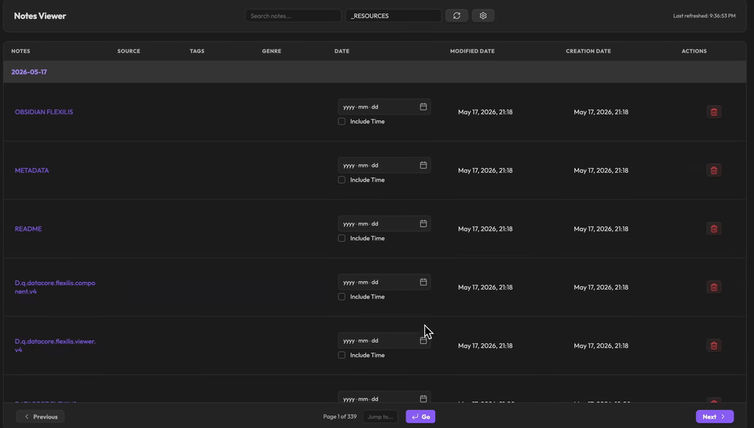
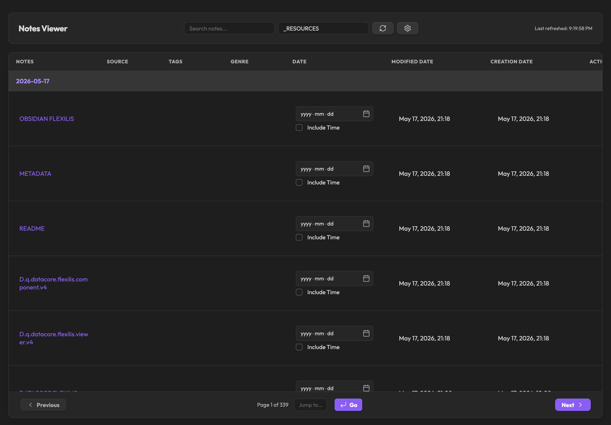

  
  
  <h1 align="center">OBSIDIAN FLEXILIS</h1>
  <h3 align="center"> Variable-Height Virtualized Data Grid and Metadata Controller </h3>

  <!-- TOP PURPLE LINKS -->
  
  
  
   
  <!-- BOTTOM GOLD TAXONOMY -->
  
  
  
  

  

    <i> A premium, high-speed database grid and frontmatter metadata controller designed natively for Obsidian. </i>
  

  

Welcome to **Obsidian Flexilis**, a lightspeed interactive metadata grid engineered to bypass complex setup, deliver instant database-grade sorting, and enable absolute real-time frontmatter editing.

### Blazing Fast Architecture
By utilizing a sterile, zero-dependency in-memory cache, Flexilis manages thousands of notes with `<1ms` computation overhead. No complex setup — just pure performance.

---

## Quick Start

To start trying Obsidian Flexilis today:
1. **Download the Repository**: Clone or download this repository directly into any folder inside your Obsidian vault.
2. **Install Datacore**: Ensure you have the **Datacore** plugin installed and enabled in Obsidian.
3. **Open the Entry Note**: Open the **`OBSIDIAN FLEXILIS.md`** note inside Obsidian to launch the component!

---

## Features

*   **Variable-Height Virtualization**: Precomputes binary search offsets to maintain butter-smooth 60fps scrolling across massive datasets.
*   **Real-Time Metadata Controller**: Modify checklist, text, tags, and date pickers directly inside the grid cells, writing changes instantly to files.
*   **Frozen Columns & Sticky Groups**: Keep your primary identifier columns (like `Notes`) and category group headers locked in place during horizontal scrolls.
*   **Reactive YAML Property Sync**: Edit layout properties (columns, sorting, heights) in frontmatter and see the dashboard update instantly with zero page reload or view flashes.

---

## Directory Index & Components

The package exposes the following compiled files:

| File | Description |
| :--- | :--- |
| **[OBSIDIAN FLEXILIS.md](OBSIDIAN%20FLEXILIS.md)** | The main entry point designed to be loaded inside Obsidian canvases or workspace leaves. |
| **[src/App.jsx](src/App.jsx)** | Main bootstrap application loader that resolves and wires the underlying views. |
| **[src/ObsidianFlexilis.component.jsx](src/ObsidianFlexilis.component.jsx)** | High-fidelity React grid and frontmatter metadata controller. |
| **[METADATA.md](METADATA.md)** | Packaging manifest outlining indexing, target, and security configurations. |
| **[CONTRIBUTION.md](CONTRIBUTION.md)** | Contributor architecture standards and local compilation guidelines. |
| **[LICENSE.md](LICENSE.md)** | MIT open-source license. |

---

## Previews

| Static View | Interactive Grid Explorer |
| :---: | :---: |
|  |  |

---

## Contributors
- beto.group
